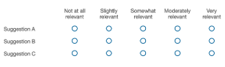

#  Survey Questionnaires 
Each participant in our human evaluation responded to 40 questions related to the suggestions generated by iZen. The following represents a sample of these questions:

**Statement**: I feel bored because my job takes up all my time.
```
Suggestion A: It is better to give yourself 100% of your time
Suggestion B: You can keep it to yourself
Suggestion C: Maybe you should consider having a career like mine: taking a long-term perspective on what is important and what is not, then taking action when it is important and deciding which matters the most
```

Are these suggestions relevant to the above Statement? Please rate each suggestion's relevancy below:
 

*Figure: Likert scale used by participants in the survey to rank the suggestions*

Does the Statement mentioned above contain enough information to provide a relevant suggestion?
```
🔘 Yes
🔘 Maybe
🔘 No
```
We provided some guidelines to the participants to clarify the requirements of the survey with examples portraying how to answer the survey questions.
